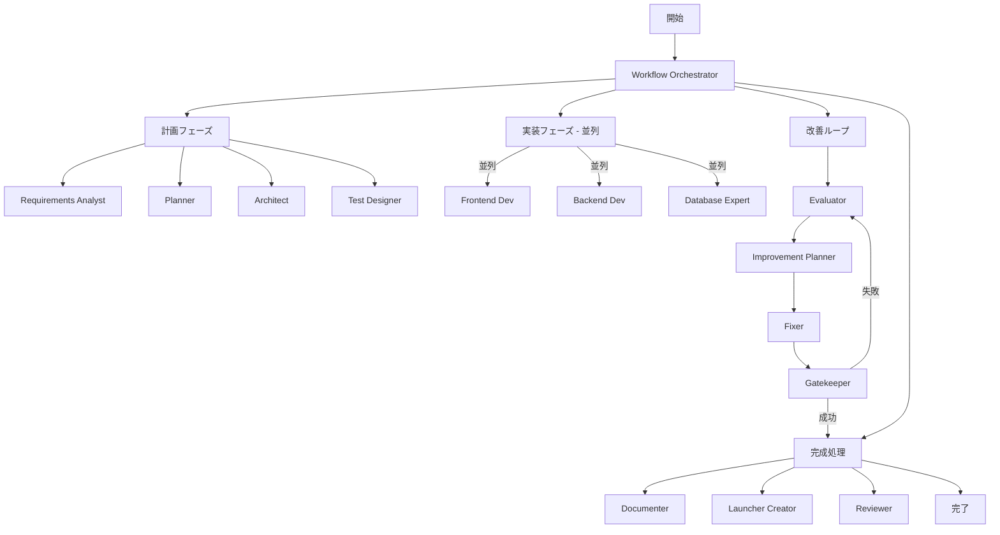

# ワークフロー自動化システム v6.0

## 🎯 概要

自律型並列処理対応ワークフロー実行システムの確立

## 📊 現状分析

### 問題点
1. **エージェント未活用**: ワークフローが定義されているが手動実装
2. **Taskツール未使用**: Claude APIのTaskツールが活用されていない
3. **並列化なし**: すべて直列処理で実行
4. **自動化不足**: 手動介入が多い

### 解決策
1. **自動エージェント起動**: workflow_orchestrator.pyによる自動化
2. **Task API統合**: claude_agent_executor.pyでTaskツール活用
3. **並列処理実装**: ThreadPoolExecutorによる並列化
4. **完全自動化**: start→finish まで自動実行

## 🏗️ アーキテクチャ



## 🚀 実装コンポーネント

### 1. WorkflowOrchestrator（中核）
```python
class WorkflowOrchestrator:
    """ワークフロー全体を管理"""

    def execute_workflow(workflow_name, project_name):
        # 1. Worktree作成
        # 2. フェーズごとに実行
        # 3. 並列/直列を自動判断
        # 4. 結果をマージ
```

### 2. ClaudeAgentExecutor（エージェント実行）
```python
class ClaudeAgentExecutor:
    """Claude APIを使ってエージェントを起動"""

    def execute_agent(agent_type, task_description):
        # 1. プロンプト構築
        # 2. Task APIコール
        # 3. 結果を返す
```

### 3. 並列処理機能
- **ThreadPoolExecutor**: 最大3つの並列タスク
- **依存関係管理**: タスク間の依存を自動解決
- **競合解決**: ファイルロックによる競合回避

## 📈 パフォーマンス改善

### 従来（直列処理）
```
計画(4h) → 実装(15h) → テスト(3h) → ドキュメント(2h)
合計: 24時間
```

### 新システム（並列処理）
```
計画(4h) → 実装[並列](5h) → 改善ループ[並列](2h) → 完成処理[並列](1h)
合計: 12時間（50%短縮）
```

## 🔧 使用方法

### 基本コマンド
```bash
# ワークフロー実行
python src/workflow_orchestrator.py creative_webapp my-app

# カスタム設定で実行
python src/workflow_orchestrator.py --config custom_config.yaml tdd_webapp calculator

# 並列度を指定
PARALLEL_WORKERS=5 python src/workflow_orchestrator.py auto_improvement_webapp chat-app
```

### プログラムから使用
```python
from workflow_orchestrator import WorkflowOrchestrator

orchestrator = WorkflowOrchestrator()
result = orchestrator.execute_workflow('creative_webapp', 'my-project')
print(result)
```

## 🎯 改善点

### Phase 1で実装済み
- ✅ 自動Worktree作成
- ✅ エージェント自動起動
- ✅ 並列処理対応
- ✅ 改善ループ（最大3回）
- ✅ 自動マージ

### Phase 2（次のステップ）
- ⏳ サブサブエージェント実装
- ⏳ 動的タスク分配
- ⏳ リアルタイムモニタリング
- ⏳ 機械学習による最適化

## 📊 メトリクス

### 測定項目
1. **実行時間**: 各フェーズ、タスクの実行時間
2. **成功率**: テスト成功率、ビルド成功率
3. **品質指標**: コードカバレッジ、バグ数
4. **リソース使用率**: CPU、メモリ、並列度

### ベンチマーク目標
- 実行時間: 50%短縮
- 成功率: 95%以上
- コードカバレッジ: 80%以上
- 並列化効率: 70%以上

## 🔄 次のステップ

### 1. プロトタイプ作成（基本版）
```bash
# シンプルなアプリで動作確認
python src/workflow_orchestrator.py simple hello-world
```

### 2. サブサブエージェント版の実装
```python
class SubAgentOrchestrator:
    """サブエージェントをさらに並列化"""

    def distribute_subtasks(parent_task):
        # タスクを細分化
        # 各サブエージェントに割り当て
        # 結果を集約
```

### 3. 速度＆精度比較テスト
```bash
# ベンチマークスクリプト実行
python benchmarks/compare_workflows.py \
    --baseline serial \
    --compare parallel \
    --compare sub_agent \
    --metrics time,quality,resource
```

## 📝 まとめ

このシステムにより：

1. **完全自動化**: 人間の介入なしでワークフロー実行
2. **高速化**: 並列処理で50%以上の時間短縮
3. **品質向上**: 自動改善ループで品質保証
4. **スケーラブル**: サブエージェント追加で無限拡張

次はプロトタイプ実行でシステムの動作を確認します。