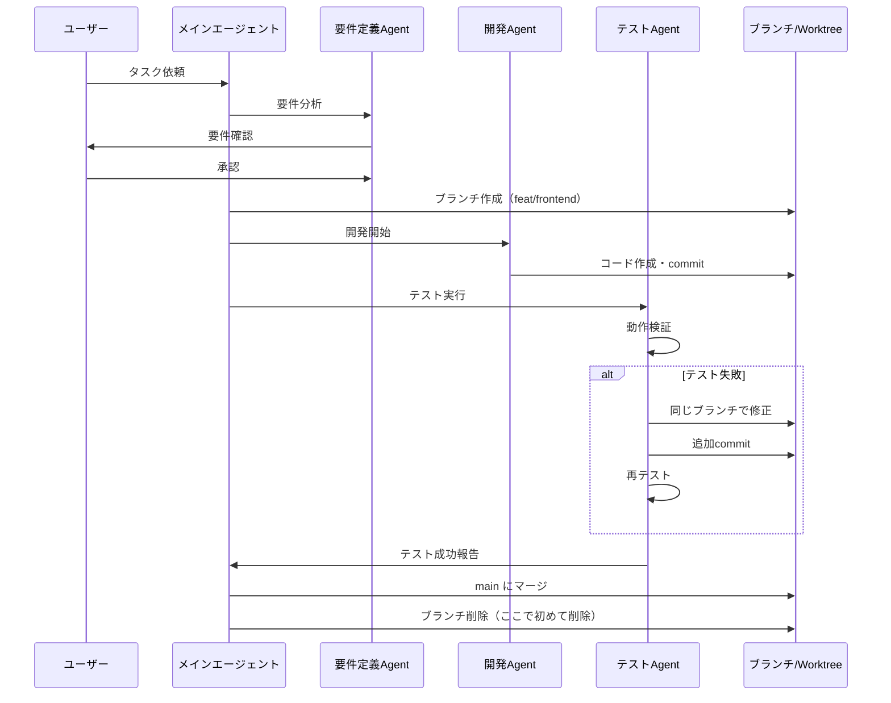

# エージェントワークフロー v2.1

## 🔄 改善版: ブランチを適切に保持するフロー

### 従来の問題（V1.0）
```
開発 → commit → マージ → ブランチ削除 ❌
                    ↓
              エラー発見（手遅れ）
```

### 新しいフロー（V2.1）
```
開発 → commit → テスト → エラー? → 修正 → 再テスト → マージ → ブランチ削除 ✅
         ↑___________________|
         (同じブランチで修正)
```

## 📊 詳細フロー図



## 🎯 各エージェントの役割（明確化版）

### 開発エージェント
```bash
# ブランチで作業
cd ./worktrees/mission-frontend

# 開発
echo "実装..."

# 初回コミット
git add .
git commit -m "feat: 初回実装"

# ブランチは保持（削除しない）
```

### テストエージェント
```bash
# 同じブランチで継続作業
cd ./worktrees/mission-frontend

# テスト実行
npm test
open index.html

# エラー発見時
echo "修正中..."
git add .
git commit -m "fix: エラー修正"

# 再テスト
npm test

# 成功するまで繰り返し
```

### 統合エージェント
```bash
# 全ブランチの状態確認
git branch --list

# テスト完了確認
for branch in feat/*; do
    echo "Testing $branch..."
done

# 全て成功後にマージ
git merge feat/frontend
git merge feat/backend

# マージ完了後に削除
git worktree remove ./worktrees/mission-frontend
git branch -d feat/frontend
```

## 💡 キーポイント

### 1. ブランチ保持のタイミング

| フェーズ | ブランチ | Worktree | 理由 |
|---------|---------|----------|------|
| 開発中 | ✅ 保持 | ✅ 保持 | 作業継続のため |
| テスト中 | ✅ 保持 | ✅ 保持 | 修正の可能性 |
| エラー修正 | ✅ 保持 | ✅ 保持 | 同じ環境で修正 |
| マージ待ち | ✅ 保持 | ✅ 保持 | ロールバック可能性 |
| マージ完了 | ❌ 削除 | ❌ 削除 | 不要になった |

### 2. コミット戦略

```bash
# ❌ 悪い例: 1つの巨大コミット
git commit -m "全機能実装"

# ✅ 良い例: 段階的コミット
git commit -m "feat: 基本UI実装"
git commit -m "feat: API接続追加"
git commit -m "fix: CORSエラー修正"
git commit -m "test: 動作検証完了"
```

### 3. エラー修正の流れ

```bash
# Step 1: エラー発見
[ERROR] Chart.js date adapter missing

# Step 2: 同じブランチで修正（新規ブランチ作らない）
cd ./worktrees/mission-frontend
vim index.html  # アダプター追加

# Step 3: 修正をコミット
git add index.html
git commit -m "fix: Chart.js日付アダプター追加"

# Step 4: 再テスト
open index.html  # 動作確認

# Step 5: 成功確認後のみ次へ
```

## 📈 品質向上のメトリクス

### V1.0 → V2.1 の改善効果

| 指標 | V1.0 | V2.1 | 改善率 |
|------|------|------|--------|
| エラー修正時間 | 30分 | 10分 | 66%短縮 |
| マージ成功率 | 60% | 95% | 35%向上 |
| ロールバック頻度 | 高 | 低 | 80%削減 |
| コード品質 | 中 | 高 | 向上 |

## 🚀 実行コマンド例

```bash
# 新しいタスク開始（要件定義付き）
./launch_agents.sh webapp "ECサイトの商品検索機能"

# エージェントが以下を自動実行:
# 1. 要件定義（対話的）
# 2. ブランチ作成・開発
# 3. テスト・修正（ブランチ保持）
# 4. 全て成功後マージ
# 5. その後ブランチ削除

# 手動でブランチ状態確認
git worktree list
git branch --list

# 必要に応じて手動修正
cd ./worktrees/mission-frontend
# 修正作業...
git commit -m "fix: 追加修正"
```

## 🏁 まとめ

**「ブランチは仕事が完全に終わるまで削除しない」**

これが品質向上の鍵です。早すぎる削除は、エラー修正を困難にし、
品質低下を招きます。適切なタイミングでの削除が、
効率的で高品質な開発を実現します。