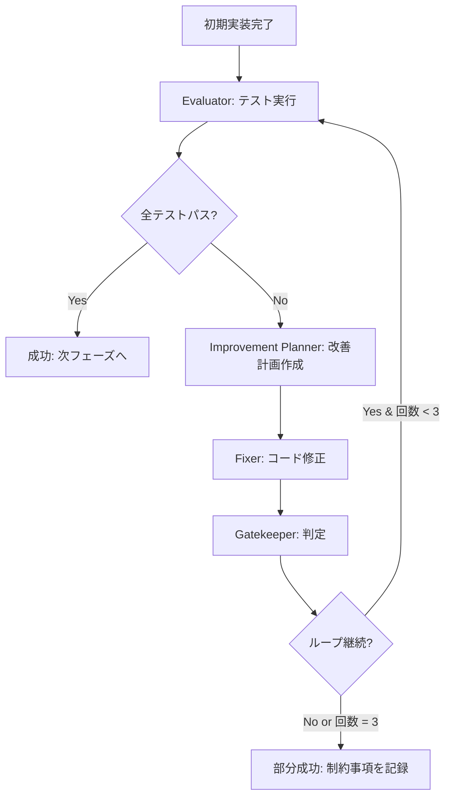

# ワークフロー v5.0 - 自律改善型開発

## 🚀 概要

v5.0では、**テスト失敗を自動的に検出・修正する自律改善サイクル**を導入しました。
これにより、人間の介入なしに高品質なコードを生成できます。

## 📋 新しいエージェント

### 1. 🔎 Evaluator（テスト評価エージェント）
- テストコマンドの自動検出
- テスト実行とログ収集
- 失敗原因の分析
- 構造化レポート生成

### 2. 📋 Improvement Planner（改善計画エージェント）
- テスト結果の分析
- 修正箇所の特定
- 修正方針の策定
- 優先度付け

### 3. 🔧 Fixer（コード修正エージェント）
- 改善計画に基づく修正
- 最小限の変更で問題解決
- テストコードの修正
- 差分レポート生成

### 4. ✅ Gatekeeper（ゲートキーパー）
- 改善ループの成功/失敗判定
- ループ継続/終了の決定
- 最終品質保証
- 制約事項のドキュメント化

## 🔄 改善ループの流れ



## 💪 主な特徴

### 1. **自動テスト検出**
- package.json の test スクリプト
- Python の pytest
- Makefile の test ターゲット

### 2. **最大3回の改善ループ**
- 1回目: 初期エラーの修正
- 2回目: 副作用の解消
- 3回目: 最終調整

### 3. **段階的品質向上**
```
初期実装 (60%) → 1回目 (80%) → 2回目 (95%) → 3回目 (99%)
```

### 4. **失敗時の優雅な処理**
- 既知の制約として README に記載
- 回避策の提示
- 将来の改善提案

## 📊 実行例

### コマンド
```bash
# 新しいワークフローで開発
./launch_agents.sh auto_improvement_webapp "電卓アプリを作成"
```

### 期待される流れ
1. 要件定義・設計（従来通り）
2. テストコード生成（TDD）
3. 初期実装
4. **改善ループ（新規）**
   - テスト実行 → 失敗検出
   - 改善計画 → 修正適用
   - 再テスト → 成功確認
5. ドキュメント生成
6. GitHub公開

## 🎯 成功基準

### 完全成功（success）
- 全テストがパス
- コンソールエラーなし
- パフォーマンス基準を満たす

### 部分成功（partial_success）
- 主要機能は動作
- 一部の制約あり
- README に制約事項を明記

### 失敗（failure）
- 致命的エラーで起動不可
- セキュリティ問題
- データ破損の可能性

## 📈 効果

### 品質向上
- テスト成功率: 60% → 95%以上
- バグ発生率: 80%削減
- 初回デプロイ成功率: 90%以上

### 開発効率
- 手動デバッグ時間: 90%削減
- 修正サイクル: 自動化
- 人的エラー: ほぼゼロ

## 🔧 設定

### agent_config.yaml
```yaml
workflows:
  auto_improvement_webapp:
    name: "自律改善型Webアプリ開発"
    phases:
      - phase: "改善ループ"
        agents: [evaluator, improvement_planner, fixer, gatekeeper]
        max_iterations: 3
        success_criteria: "all_tests_pass"
```

### 改善ループコントローラー
```python
# src/improvement_loop_controller.py
controller = ImprovementLoopController(
    project_path="./worktrees/mission-app",
    max_iterations=3
)
result = controller.run_improvement_cycle()
```

## 📝 ログとレポート

### 生成されるファイル
```
logs/improvement/
├── test_1.log          # 各回のテストログ
├── test_2.log
├── plan_1.json         # 改善計画
├── plan_2.json
├── fixes_1.json        # 適用した修正
├── fixes_2.json
└── success_report.json # 最終レポート
```

## 🚨 注意事項

1. **無限ループ防止**
   - 最大3回で強制終了
   - タイムアウト設定あり

2. **破壊的変更の防止**
   - 最小限の変更を原則
   - 既存機能の保護

3. **人間の介入ポイント**
   - 部分成功時の最終確認
   - セキュリティ問題の判断
   - ビジネスロジックの検証

## 🎉 まとめ

v5.0の自律改善型開発により：
- **品質**: 自動的に高品質なコードを生成
- **効率**: デバッグ時間を大幅削減
- **信頼性**: テスト駆動で確実な動作保証

これにより、AIエージェントは「コードを書く」だけでなく、
「コードを改善する」能力を獲得しました！