# Dungeon Battles - Architecture Diagram

## Overview
This document provides the complete system architecture for Dungeon Battles, following component-based design principles with strict adherence to the 500-line class limit and 200-line GameCore limit.

---

## System Architecture Diagram (PlantUML)

```plantuml
@startuml Dungeon Battles Architecture

!define CORE_COLOR #E1F5FE
!define SYSTEM_COLOR #FFF9C4
!define ENTITY_COLOR #F0F4C3
!define MANAGER_COLOR #FFE0B2
!define STATE_COLOR #E1BEE7

package "Core Layer" <<Rectangle>> CORE_COLOR {
  class GameCore {
    - systems: Map<string, System>
    - entityManager: EntityManager
    - stateManager: StateManager
    - pools: Map<string, ObjectPool>
    - performance: PerformanceMonitor
    - running: boolean
    - lastTime: number
    + init(): void
    + start(): void
    + stop(): void
    + update(deltaTime: number): void
    + render(): void
    - registerCollisions(): void
  }

  class EntityManager {
    - entities: Entity[]
    - entitiesToAdd: Entity[]
    - entitiesToRemove: Entity[]
    - entityIdCounter: number
    + addEntity(entity: Entity): void
    + removeEntity(entity: Entity): void
    + getEntitiesByType(type: string): Entity[]
    + update(deltaTime: number): void
    + clear(): void
  }

  class ObjectPool {
    - createFn: Function
    - resetFn: Function
    - pool: Object[]
    - active: Object[]
    - maxSize: number
    + acquire(): Object
    + release(obj: Object): void
    + releaseAll(): void
    + getActiveCount(): number
  }

  class PerformanceMonitor {
    - fps: number
    - frameTime: number
    - frameCount: number
    - lastFpsUpdate: number
    - memoryUsage: number
    + startFrame(): void
    + endFrame(): void
    + getFPS(): number
    + getFrameTime(): number
    + checkMemory(): void
  }
}

package "System Layer" <<Rectangle>> SYSTEM_COLOR {
  interface ISystem {
    + update(entities: Entity[], deltaTime: number): void
    + init(): void
  }

  class InputSystem implements ISystem {
    - keys: Map<string, boolean>
    - mousePos: {x: number, y: number}
    - touches: Touch[]
    - virtualJoystick: VirtualJoystick
    - buttonStates: Map<string, boolean>
    + init(): void
    + update(): void
    + isKeyDown(key: string): boolean
    + getJoystickAxis(): {x: number, y: number}
    + isButtonPressed(button: string): boolean
  }

  class PhysicsSystem implements ISystem {
    - gravity: number
    - friction: number
    + init(): void
    + update(entities: Entity[], deltaTime: number): void
    - applyVelocity(entity: Entity, deltaTime: number): void
    - checkBounds(entity: Entity): void
  }

  class CollisionSystem implements ISystem {
    - quadTree: QuadTree
    - collisionPairs: Map<string, Function>
    - collisionHistory: Set<string>
    + init(): void
    + registerPair(typeA: string, typeB: string, callback: Function): void
    + update(entities: Entity[]): void
    - checkCollision(a: Entity, b: Entity): boolean
    - handleCollision(a: Entity, b: Entity): void
    - getCollisionKey(a: Entity, b: Entity): string
  }

  class RenderSystem implements ISystem {
    - canvas: HTMLCanvasElement
    - ctx: CanvasRenderingContext2D
    - camera: Camera
    - layers: Map<string, Layer>
    + init(): void
    + update(): void
    + clear(): void
    + renderBackground(): void
    + renderEntities(entities: Entity[]): void
    + renderUI(): void
    - sortByZIndex(entities: Entity[]): Entity[]
  }

  class EffectSystem implements ISystem {
    - effects: Effect[]
    - particlePools: Map<string, ObjectPool>
    - effectConfigs: Map<string, EffectConfig>
    + init(): void
    + registerEffect(name: string, config: EffectConfig): void
    + spawn(effectName: string, x: number, y: number, options: Object): Effect
    + update(deltaTime: number): void
    + render(ctx: CanvasRenderingContext2D): void
  }

  class DebugSystem implements ISystem {
    - enabled: boolean
    - showCollisionBoxes: boolean
    - showFPS: boolean
    - showEntityCount: boolean
    - logs: string[]
    - paused: boolean
    - stepFrame: boolean
    + init(): void
    + setupKeyboardShortcuts(): void
    + update(): void
    + render(ctx: CanvasRenderingContext2D, game: GameCore): void
    + log(message: string, type: string): void
    + togglePause(): void
  }
}

package "Entity Layer" <<Rectangle>> ENTITY_COLOR {
  abstract class Entity {
    # id: number
    # type: string
    # x: number
    # y: number
    # width: number
    # height: number
    # velocity: {x: number, y: number}
    # alive: boolean
    # zIndex: number
    + update(deltaTime: number): void
    + render(ctx: CanvasRenderingContext2D): void
    + destroy(): void
    + getBounds(): {left, right, top, bottom}
  }

  class Player extends Entity {
    - hp: number
    - maxHp: number
    - mp: number
    - maxMp: number
    - attackPower: number
    - magicPower: number
    - attackCooldown: number
    - magicCooldown: number
    - invincible: boolean
    - invincibleTime: number
    + update(deltaTime: number): void
    + render(ctx: CanvasRenderingContext2D): void
    + attack(): Bullet
    + magicAttack(): Bullet
    + takeDamage(damage: number): void
    + heal(amount: number): void
    + restoreMP(amount: number): void
  }

  class Enemy extends Entity {
    - hp: number
    - maxHp: number
    - damage: number
    - fireRate: number
    - fireCooldown: number
    - movePattern: string
    - attackPattern: string
    - stage: number
    + update(deltaTime: number): void
    + render(ctx: CanvasRenderingContext2D): void
    + takeDamage(damage: number): void
    + fire(): Bullet[]
    + move(deltaTime: number): void
  }

  class Boss extends Enemy {
    - phase: number
    - summonCooldown: number
    - patterns: AttackPattern[]
    - currentPattern: number
    + update(deltaTime: number): void
    + switchPhase(): void
    + summonMinions(): Enemy[]
    + executePattern(): Bullet[]
  }

  class Bullet extends Entity {
    - damage: number
    - owner: Entity
    - homing: boolean
    - target: Entity
    - lifetime: number
    - maxLifetime: number
    + update(deltaTime: number): void
    + render(ctx: CanvasRenderingContext2D): void
    + reset(): void
  }

  class Item extends Entity {
    - itemType: string
    - value: number
    - lifetime: number
    - maxLifetime: number
    + update(deltaTime: number): void
    + render(ctx: CanvasRenderingContext2D): void
    + collect(player: Player): void
  }

  class Particle extends Entity {
    - color: string
    - size: number
    - alpha: number
    - fadeRate: number
    - lifetime: number
    + update(deltaTime: number): void
    + render(ctx: CanvasRenderingContext2D): void
    + reset(): void
  }
}

package "State Management" <<Rectangle>> STATE_COLOR {
  class StateManager {
    - currentState: GameState
    - states: Map<string, GameState>
    + registerState(name: string, state: GameState): void
    + changeState(name: string): void
    + update(deltaTime: number): void
    + render(ctx: CanvasRenderingContext2D): void
  }

  interface GameState {
    + enter(): void
    + exit(): void
    + update(deltaTime: number): void
    + render(ctx: CanvasRenderingContext2D): void
  }

  class MenuState implements GameState {
    - selectedOption: number
    - options: string[]
    + enter(): void
    + exit(): void
    + update(deltaTime: number): void
    + render(ctx: CanvasRenderingContext2D): void
  }

  class PlayState implements GameState {
    - currentStage: number
    - score: number
    - continues: number
    - player: Player
    - currentEnemy: Enemy
    - items: Item[]
    + enter(): void
    + exit(): void
    + update(deltaTime: number): void
    + render(ctx: CanvasRenderingContext2D): void
    + nextStage(): void
    + gameOver(): void
    + continue(): void
  }

  class PauseState implements GameState {
    - previousState: GameState
    + enter(): void
    + exit(): void
    + update(deltaTime: number): void
    + render(ctx: CanvasRenderingContext2D): void
  }

  class GameOverState implements GameState {
    - finalScore: number
    - victory: boolean
    + enter(): void
    + exit(): void
    + update(deltaTime: number): void
    + render(ctx: CanvasRenderingContext2D): void
  }
}

package "Utilities" <<Rectangle>> MANAGER_COLOR {
  class QuadTree {
    - maxObjects: number
    - maxLevels: number
    - level: number
    - bounds: Rectangle
    - objects: Entity[]
    - nodes: QuadTree[]
    + clear(): void
    + split(): void
    + insert(entity: Entity): void
    + retrieve(entity: Entity): Entity[]
  }

  class Camera {
    - x: number
    - y: number
    - width: number
    - height: number
    - target: Entity
    - smoothing: number
    + follow(target: Entity): void
    + update(deltaTime: number): void
    + worldToScreen(x: number, y: number): {x, y}
    + screenToWorld(x: number, y: number): {x, y}
  }

  class VirtualJoystick {
    - centerX: number
    - centerY: number
    - radius: number
    - active: boolean
    - touchId: number
    - axis: {x: number, y: number}
    + update(touches: Touch[]): void
    + render(ctx: CanvasRenderingContext2D): void
    + getAxis(): {x: number, y: number}
  }

  class AssetLoader {
    - images: Map<string, HTMLImageElement>
    - sounds: Map<string, AudioBuffer>
    - loadQueue: string[]
    - loadedCount: number
    + loadImage(name: string, path: string): Promise
    + loadSound(name: string, path: string): Promise
    + loadAll(manifest: Object): Promise
    + getImage(name: string): HTMLImageElement
    + getSound(name: string): AudioBuffer
  }
}

' Relationships
GameCore --> EntityManager
GameCore --> StateManager
GameCore --> ObjectPool
GameCore --> PerformanceMonitor
GameCore --> InputSystem
GameCore --> PhysicsSystem
GameCore --> CollisionSystem
GameCore --> RenderSystem
GameCore --> EffectSystem
GameCore --> DebugSystem

StateManager --> GameState
StateManager --> MenuState
StateManager --> PlayState
StateManager --> PauseState
StateManager --> GameOverState

PlayState --> Player
PlayState --> Enemy
PlayState --> Boss
PlayState --> Item

EntityManager --> Entity
Entity <|-- Player
Entity <|-- Enemy
Entity <|-- Boss
Entity <|-- Bullet
Entity <|-- Item
Entity <|-- Particle

CollisionSystem --> QuadTree
RenderSystem --> Camera
InputSystem --> VirtualJoystick
EffectSystem --> Particle
EffectSystem --> ObjectPool

@enduml
```



---

## Component Descriptions

### Core Layer

#### GameCore (< 200 lines)
**Responsibility**: Central game loop coordinator
- Initializes all systems in correct order
- Manages game loop (update/render)
- Coordinates system communication
- Does NOT contain game logic (delegated to systems)

**Key Methods**:
- `init()`: Initialize all systems and register collision pairs
- `update(deltaTime)`: Call system updates in fixed order
- `render()`: Delegate rendering to RenderSystem

#### EntityManager
**Responsibility**: Lifecycle management of all game objects
- Add/remove entities safely (deferred to avoid mid-loop issues)
- Query entities by type
- Update all entities each frame

#### ObjectPool
**Responsibility**: Memory optimization through object reuse
- Pre-allocate objects (bullets, particles, enemies)
- Acquire/release pattern
- Prevents garbage collection stutters

#### PerformanceMonitor
**Responsibility**: Track game performance metrics
- FPS calculation
- Frame time tracking
- Memory usage monitoring

---

### System Layer

#### InputSystem
**Responsibility**: Handle all user input
- Keyboard input (PC)
- Touch input (mobile)
- Virtual joystick management
- Button state tracking

**No game logic**: Just provides input state to other systems

#### PhysicsSystem
**Responsibility**: Apply physics to entities
- Velocity application
- Boundary checking
- Simple gravity/friction (if needed)

**Does NOT**: Handle collisions (that's CollisionSystem's job)

#### CollisionSystem
**Responsibility**: Detect and respond to collisions
- Spatial partitioning with QuadTree
- AABB collision detection
- Callback-based collision responses
- Prevents duplicate collision handling

**Critical**: Built from day 1, not added later

#### RenderSystem
**Responsibility**: Draw everything to screen
- Layer-based rendering
- Z-index sorting
- Camera management
- Background/foreground separation

#### EffectSystem
**Responsibility**: Visual effects and particle management
- Particle pool management
- Effect spawning (explosions, hits, etc.)
- Particle lifecycle
- Blend mode rendering

#### DebugSystem
**Responsibility**: Development tools and visualization
- Collision box rendering
- FPS display
- Entity count
- Pause/step functionality
- Console logging

---

### Entity Layer

#### Entity (Abstract Base)
**Responsibility**: Common properties for all game objects
- Position, size, velocity
- Lifecycle (alive/dead)
- Render order (zIndex)
- Bounds calculation

#### Player
**Responsibility**: Player character logic
- HP/MP management
- Attack cooldowns
- Input-driven movement
- Damage/healing

#### Enemy
**Responsibility**: Enemy behavior
- AI movement patterns
- Attack patterns
- HP management
- Stage-specific behavior

#### Boss
**Responsibility**: Boss-specific mechanics
- Multi-phase behavior
- Complex attack patterns
- Minion summoning
- Pattern switching

#### Bullet
**Responsibility**: Projectile behavior
- Movement
- Homing logic (if applicable)
- Lifetime management
- Collision damage

#### Item
**Responsibility**: Collectible items
- Spawn timing
- Lifetime countdown
- Collection effects
- Visual pulsing

#### Particle
**Responsibility**: Visual effect particle
- Fading
- Color interpolation
- Size changes
- Short lifetime

---

### State Management

#### StateManager
**Responsibility**: Game state transitions
- Current state tracking
- State switching
- Delegates update/render to active state

#### MenuState
**Responsibility**: Main menu
- Option selection
- Start game transition

#### PlayState
**Responsibility**: Active gameplay
- Stage progression
- Score tracking
- Continue system
- Win/lose conditions

#### PauseState
**Responsibility**: Paused game
- Resume/quit options
- Preserves previous state

#### GameOverState
**Responsibility**: End screen
- Display final score
- Victory/defeat message
- Restart option

---

### Utilities

#### QuadTree
**Responsibility**: Spatial partitioning for collision optimization
- Reduces collision checks from O(n²) to O(n log n)
- Dynamic subdivision

#### Camera
**Responsibility**: View management
- Smooth following
- Screen/world coordinate conversion
- Vertical scrolling

#### VirtualJoystick
**Responsibility**: Touch-based movement control
- Visual joystick rendering
- Axis calculation
- Touch tracking

#### AssetLoader
**Responsibility**: Resource loading
- Image loading
- Sound loading
- Progress tracking
- Asset caching

---

## System Dependencies

### Initialization Order
1. AssetLoader (load all resources first)
2. InputSystem
3. CollisionSystem (register collision pairs)
4. PhysicsSystem
5. EffectSystem
6. RenderSystem
7. DebugSystem
8. StateManager (initialize states)

### Update Order (Each Frame)
1. InputSystem (capture input)
2. EntityManager (update all entities)
3. PhysicsSystem (apply movement)
4. CollisionSystem (detect/handle collisions)
5. EffectSystem (update particles)
6. StateManager (update current state)

### Render Order (Each Frame)
1. RenderSystem.clear()
2. RenderSystem.renderBackground()
3. RenderSystem.renderEntities() (sorted by zIndex)
4. EffectSystem.render() (particles on top)
5. RenderSystem.renderUI()
6. DebugSystem.render() (debug info on top)

---

## File Size Constraints

### Strict Limits
- **GameCore.js**: ≤ 200 lines
- **Each System**: ≤ 500 lines
- **Each Entity**: ≤ 500 lines
- **Each State**: ≤ 500 lines

### How to Stay Under Limits
1. **Single Responsibility**: Each class does ONE thing
2. **Delegate**: GameCore delegates to systems, doesn't implement logic
3. **Extract**: Move complex logic to helper functions/classes
4. **Composition**: Combine small components instead of large monoliths

---

## Collision Pairs Registration

```javascript
// In GameCore.registerCollisions()
collision.registerPair('player', 'enemy', (player, enemy) => {
  player.takeDamage(enemy.damage);
  player.invincible = true; // Brief invincibility
});

collision.registerPair('player-bullet', 'enemy', (bullet, enemy) => {
  enemy.takeDamage(bullet.damage);
  bullet.destroy();
  effectSystem.spawn('hit', enemy.x, enemy.y);
});

collision.registerPair('enemy-bullet', 'player', (bullet, player) => {
  player.takeDamage(bullet.damage);
  bullet.destroy();
  effectSystem.spawn('hit', player.x, player.y);
});

collision.registerPair('player', 'item', (player, item) => {
  item.collect(player);
  effectSystem.spawn('collect', item.x, item.y);
});

collision.registerPair('player', 'powerup', (player, powerup) => {
  if (powerup.type === 'weapon') player.attackPower += 5;
  if (powerup.type === 'magic') player.magicPower += 10;
  powerup.destroy();
  effectSystem.spawn('powerup', powerup.x, powerup.y);
});
```

---

## Design Principles Applied

### 1. Component-Based Architecture
- Systems are independent, reusable components
- Entities composed of data, systems provide behavior
- Easy to test each system in isolation

### 2. Separation of Concerns
- InputSystem: ONLY input
- PhysicsSystem: ONLY movement
- CollisionSystem: ONLY collision detection
- RenderSystem: ONLY drawing

### 3. Event-Driven Communication
- CollisionSystem uses callbacks
- StateManager uses state pattern
- Loose coupling between components

### 4. Performance Optimization
- ObjectPool: Eliminate garbage collection
- QuadTree: Reduce collision checks
- Layer rendering: Skip offscreen objects

### 5. Maintainability
- Small files (< 500 lines)
- Clear naming
- Single responsibility
- Easy to locate and fix bugs

---

## Testing Strategy

### Unit Tests
- Each system in isolation
- Mock dependencies
- Test collision detection accuracy
- Test physics calculations

### Integration Tests
- System interactions
- State transitions
- Full gameplay scenarios

### Performance Tests
- FPS under max entity load (200 objects)
- Memory leak detection
- Frame time consistency

---

## Version History
- **v1.0** - Initial architecture design (2025-12-11)
